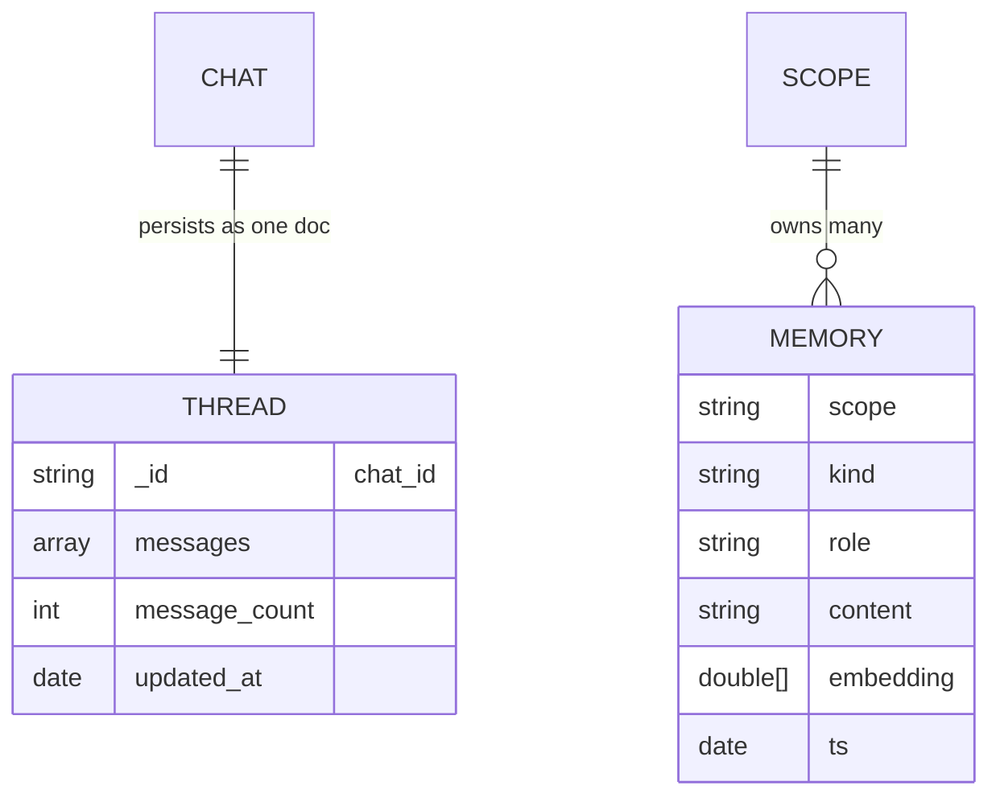

# EDD.md — Entity Document Diagram

The MongoDB data model for `agency-swarm-mongodb`. Two collections back the two stores:
`threads` (`MongoThreadStore`) and `memories` (`MongoMemoryStore`). Keep this in sync with
`src/agency_swarm_mongodb/store.py` and `memory.py`.

## Entities

### `threads` (database `agency_swarm`)

One document per `chat_id`, holding the full flat message list exactly as Agency Swarm emits.

| Field | Type | Required | Description |
|---|---|---|---|
| `_id` | string | yes | The `chat_id` (primary key) |
| `messages` | array<object> | yes | Full flat list of conversation messages |
| `message_count` | int | yes | Count of `messages` |
| `updated_at` | date | yes | Last upsert time (UTC); TTL anchor when enabled |

```json
{
  "_id": "user-123",
  "messages": [ { "role": "user", "content": "…" } ],
  "message_count": 12,
  "updated_at": { "$date": "2025-01-01T00:00:00Z" }
}
```

### `memories` (database `agency_swarm`)

One document per memory record (semantic fact or episodic turn).

| Field | Type | Required | Description |
|---|---|---|---|
| `scope` | string | yes | Tenant / conversation / agent scope key |
| `kind` | string | yes | `"semantic"` or `"episodic"` |
| `role` | string | yes | Message role (`user`/`assistant`/…) |
| `content` | string | yes | The remembered text |
| `embedding` | double[1024] | bring-your-own path only | Voyage 3.5 vector |
| `ts` | date | yes | Timestamp; TTL anchor when enabled |
| `meta` | object | no | Arbitrary metadata |

```json
{
  "scope": "user-123",
  "kind": "semantic",
  "role": "user",
  "content": "Prefers window seats.",
  "embedding": [0.01, "… 1024 dims …"],
  "ts": { "$date": "2025-01-01T00:00:00Z" },
  "meta": {}
}
```

## Indexes

- `threads`: optional TTL `{ updated_at: 1 }, expireAfterSeconds=ttl_seconds` (`ttl_updated_at`).
- `memories`: optional TTL on `ts`; Atlas Vector Search index `idx_agent_memory` over
  `embedding` (`numDimensions: 1024`, cosine) — or an `autoEmbed` index when
  `auto_embed=True` (Atlas Automated Embedding, recall by query text).

## Relationships



## Notes

- Demo seed data: the shared `data/embeddings.json` corpus (team-member documents with
  pre-computed 1024-dim Voyage 3.5 `embedding` vectors), used by the staffing/agent demos.
- `MongoThreadStore` writes are idempotent upserts keyed by `_id`.
- appName: `devrel-integ-agencyswarm-python`; driver-info: `agency-swarm-mongodb`.
